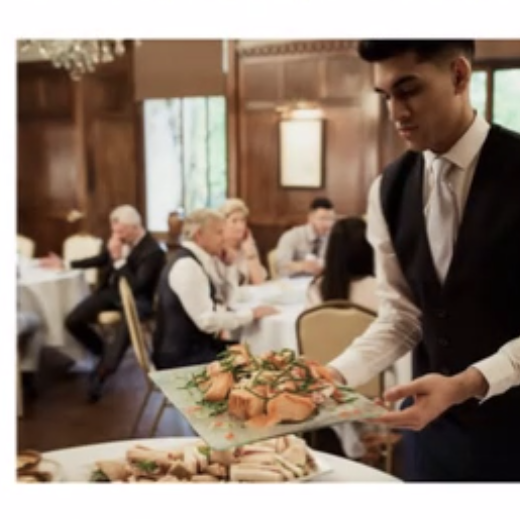
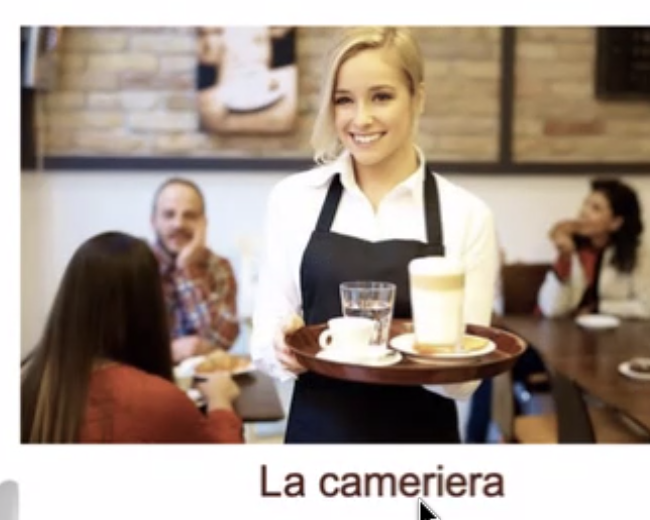
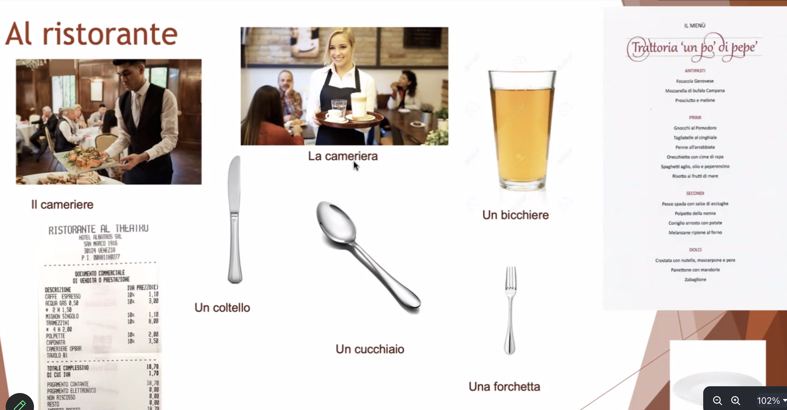
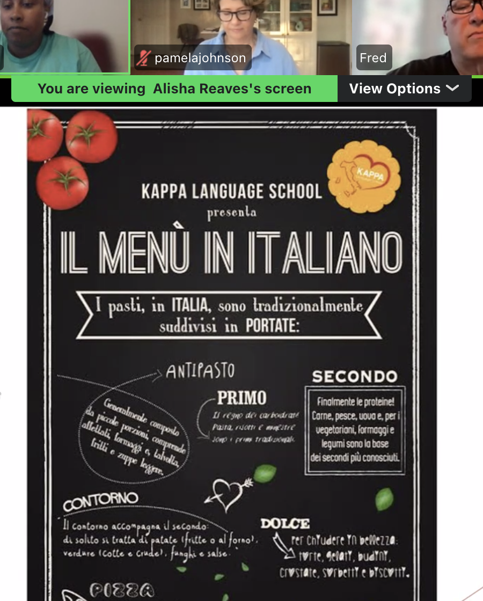
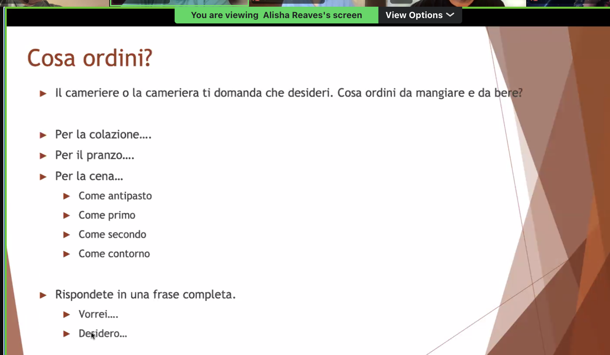
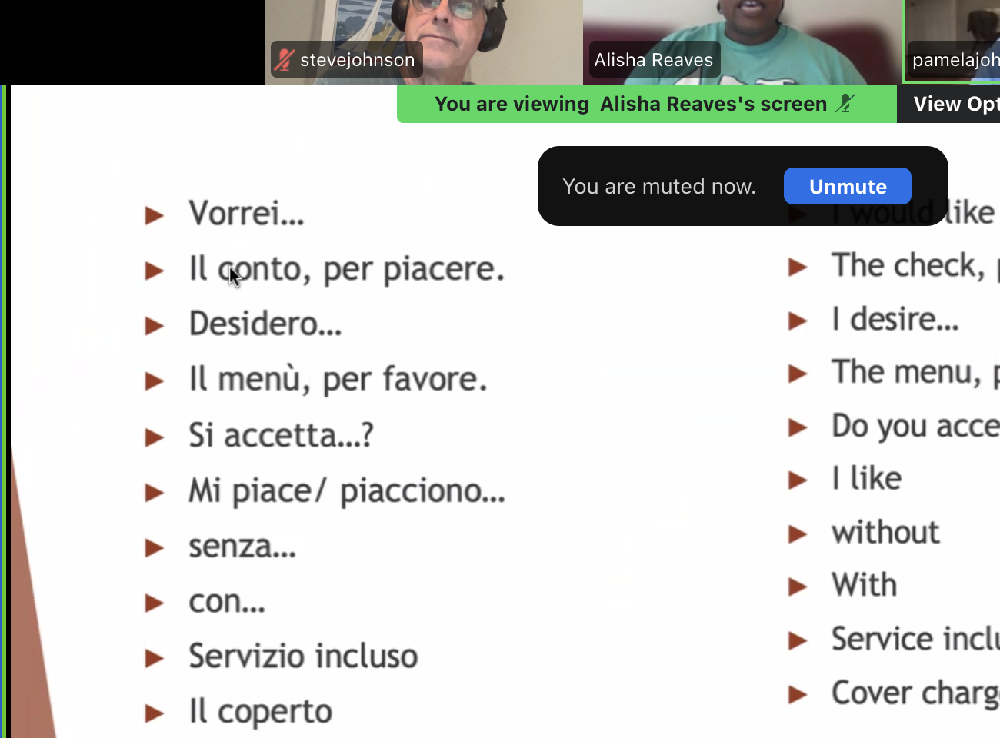
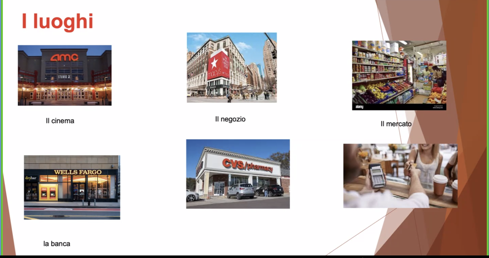
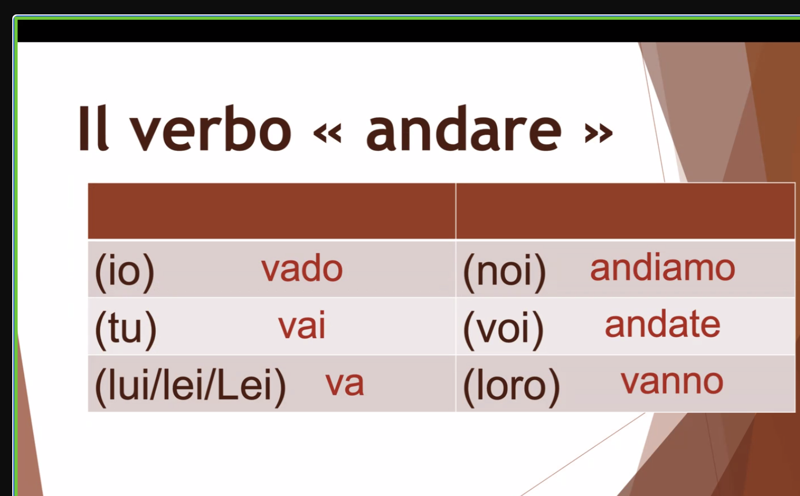
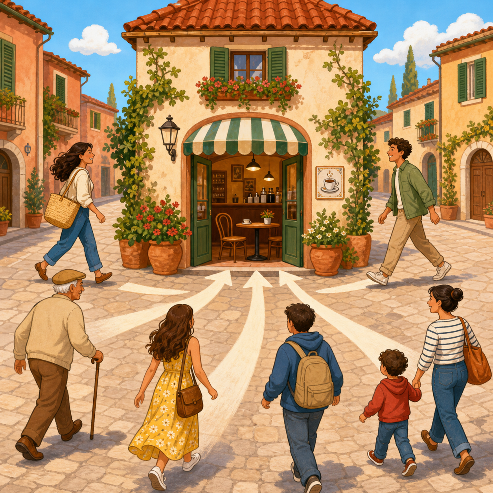
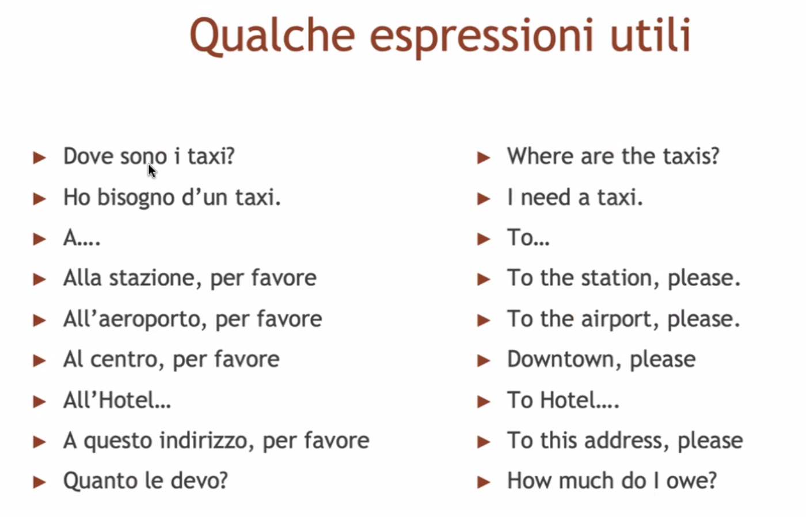

# July 22 Visual Flashcards

## Use

Look at the image, say the Italian aloud, then reveal the answer. These are
exact crops from the supplied class screenshots. They are derived classroom
evidence, not newly generated illustrations.

---

## Il cameriere



**Italian:** il cameriere  
**English:** the waiter

Say:

```text
Il cameriere porta il cibo.
```

---

## La cameriera



**Italian:** la cameriera  
**English:** the waitress

Say:

```text
La cameriera porta un bicchiere.
```

---

## Restaurant objects



Point and say:

```text
un bicchiere
un coltello
un cucchiaio
una forchetta
il menù
il conto
```

Then ask:

```text
Come si dice “spoon” in italiano?
```

---

## Meal courses



Say in order:

```text
l'antipasto
il primo
il secondo
il contorno
il dolce
```

Choose:

```text
Vorrei un primo e un contorno.
```

---

## Cosa ordini?



Question:

```text
Cosa ordini da mangiare e da bere?
```

Answer in one complete line:

```text
Vorrei...
Desidero...
```

---

## Useful restaurant phrases



Practice:

```text
Il menù, per favore.
Il conto, per piacere.
Mi piace...
Mi piacciono...
con...
senza...
```

---

## I luoghi



Name the visibly labeled places:

```text
il cinema
il negozio
il mercato
la banca
```

Then answer:

```text
Dove vai?
Vado al mercato.
```

The lower pharmacy and counter images are retained as visual prompts, but their
labels are obscured in this crop and are not asserted as exact transcription.

---

## Andare



Say a useful line before reciting the table:

```text
Vado al ristorante.
```

Then clarify:

```text
vado
vai
va
andiamo
andate
vanno
```

---

## Venire



No complete `venire` table is visible in the supplied screenshots. This is a
newly generated practice mnemonic, not classroom evidence. The site reuses it
across six small listening and retrieval cards:

```text
Io vengo al ristorante.
Tu vieni al ristorante.
Lei viene al ristorante.
Noi veniamo al ristorante.
Voi venite al ristorante.
Loro vengono al ristorante.
```

---

## Taxi



Practice the exchange:

```text
Ho bisogno di un taxi.
Dove va?
Alla stazione, per favore.
Quanto le devo?
```
